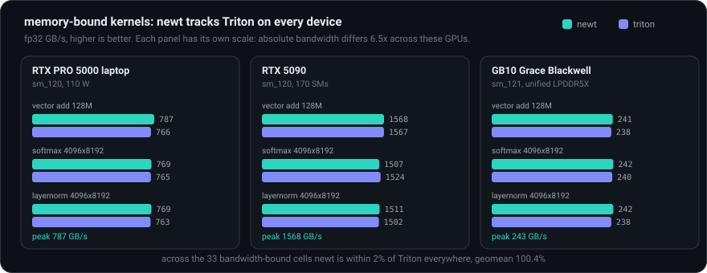
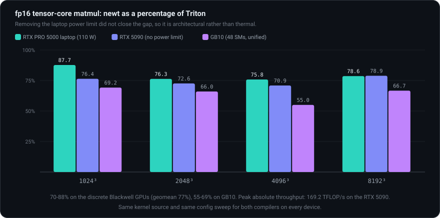
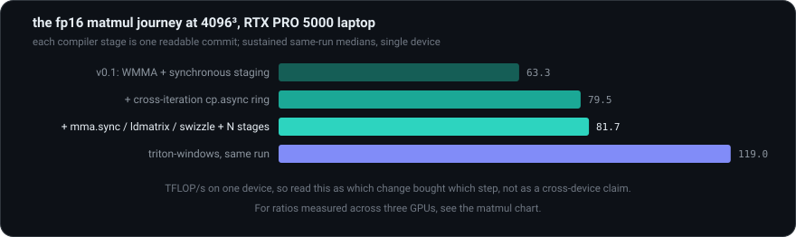

<p align="center">
  <a href="https://arpitsinghgautam.github.io/nano-triton/"></a>
</p>

**A from-scratch nano-Triton and nano-Helion**: the modern GPU-kernel DSL
stack, rebuilt in ~4,000 lines of readable Python. Measured on three GPUs, it
holds memory-bandwidth parity with real Triton and reaches 70-88% of its
tensor-core matmul throughput on discrete Blackwell parts.

*Small enough to read in an afternoon, real enough to benchmark.*

<p align="center">
  <a href="https://pypi.org/project/nano-triton/"></a>
  
  
  <a href="https://colab.research.google.com/github/arpitsinghgautam/nano-triton/blob/main/examples/demo.ipynb"></a>
</p>

<p align="center">
  <a href="https://pypi.org/project/nano-triton/"><b>PyPI</b></a> |
  <a href="https://colab.research.google.com/github/arpitsinghgautam/nano-triton/blob/main/examples/demo.ipynb"><b>Demo notebook</b></a> |
  <a href="https://arpitsinghgautam.github.io/nano-triton/"><b>Project site</b></a> |
  <a href="docs/OVERVIEW.md">The full story, from zero</a> |
  <a href="#benchmarks">Benchmarks</a>
</p>

## What this is

[Triton](https://github.com/triton-lang/triton) (OpenAI) lets you write GPU
kernels as Python functions over blocks of data; its compiler handles thread
mapping, memory coalescing, shared memory and tensor cores.
[Helion](https://github.com/pytorch/helion) (PyTorch) sits one level higher:
PyTorch-like tile code, compiled down to Triton and autotuned. Both are
large industrial compilers. Their ideas, however, are compact - and this
repo rebuilds the whole two-layer stack in miniature:

<p align="center">
  
</p>

**Highlights**

- **Real machine code, not a simulator**: kernels JIT-compile through NVRTC
  and launch through the raw CUDA driver API via ctypes. No nvcc subprocess,
  no cuda-python, no MLIR.
- **Real tensor cores**: fp16/bf16 matmuls compile to raw `ldmatrix` +
  `mma.sync` PTX over XOR-swizzled shared memory, fed by an N-stage
  `cp.async` pipeline - `num_stages` is a real tuning knob here, like in
  Triton.
- **Real performance, measured on three GPUs**: memory-bound kernels
  (softmax, layernorm, elementwise) sit within 2% of Triton on every device,
  geomean 100.4%; fp16 tensor-core matmul reaches 70-88% of Triton on the two
  discrete Blackwell cards and 55-69% on GB10. Same source, same config sweep.
- **Triton-compatible surface**: replace `tl` with `nl` and most kernels
  just run - same `@jit`/grid protocol, `constexpr` specialization, masked
  loads/stores, `@autotune`/`@heuristics`, atomics, grids up to 3D.
- **A working nano-Helion on top**: write tile-level PyTorch-like code with
  zero kernel details; deuteron generates the newt kernel, verifies
  candidate configs against an eager PyTorch oracle, and autotunes.
- **Tested against PyTorch**: 176 pytest tests cover every op, control
  flow, boundary masks and the pipeline state machine; every bug found
  during development left a regression test behind.

## Quick start

```
pip install nano-triton       # needs torch + an NVIDIA GPU + CUDA toolkit
```

That installs both `newt` and `deuteron`. To hack on the source instead:

```
git clone https://github.com/arpitsinghgautam/nano-triton
cd nano-triton
pip install -e .
python -m pytest tests -q     # 176 tests (GPU ones self-skip without CUDA)
```

A newt kernel is a Triton kernel with the serial numbers filed off:

```python
import torch
import newt
import newt.language as nl

@newt.jit
def add_kernel(x_ptr, y_ptr, out_ptr, n, BLOCK: nl.constexpr):
    pid = nl.program_id(0)
    offs = pid * BLOCK + nl.arange(0, BLOCK)
    mask = offs < n
    x = nl.load(x_ptr + offs, mask=mask)
    y = nl.load(y_ptr + offs, mask=mask)
    nl.store(out_ptr + offs, x + y, mask=mask)

x, y = torch.randn(2, 1_000_000, device="cuda")
out = torch.empty_like(x)
add_kernel[lambda meta: (newt.cdiv(1_000_000, meta["BLOCK"]),)](
    x, y, out, 1_000_000, BLOCK=1024)
```

And the same matmul, one level up, with no kernel-level details at all:

```python
import deuteron as dt

@dt.kernel
def matmul(x, y, out):
    for tile_m, tile_n in dt.tile([x.shape[0], y.shape[1]]):   # launch grid
        acc = dt.zeros([tile_m, tile_n], dtype=dt.float32)
        for tile_k in dt.tile(x.shape[1]):                     # k-loop
            acc += x[tile_m, tile_k] @ y[tile_k, tile_n]       # tensor cores
        out[tile_m, tile_n] = acc

matmul(x, y, out)     # traces, generates a newt kernel, autotunes, caches
matmul.ref(x, y, out) # the same function as plain PyTorch (the oracle)
print(matmul.to_newt_source(x, y, out))  # inspect the generated kernel
```

## Benchmarks

Three GPUs, chosen to vary the things a single-machine comparison would
confound: an RTX PRO 5000 Blackwell laptop (sm_120, 110 W, throttles), an RTX
5090 (sm_120, 170 SMs, no observed throttling), and a GB10 Grace Blackwell
(sm_121, 48 SMs, unified LPDDR5X, aarch64 host). Identical kernel source
(modulo `nl`/`tl`) and identical config sweeps for newt and triton; medians
over 50 reps with L2 flushed between reps. Full tables and threats to validity
in [benchmarks/results.md](benchmarks/results.md); rerun with
`python benchmarks/bench.py --cooldown 300`.

**Memory-bound kernels: parity, on every device.** Once a kernel is coalesced,
vectorized and fused, everyone saturates the memory bus and there is nothing
left to win. Across the 33 bandwidth-bound cells newt is within 2% of Triton
everywhere, geomean **100.4%**, and it records the highest measured streaming
bandwidth of the three frameworks on both the laptop and the 5090.

<p align="center">
  
</p>

**Tensor-core matmul: where the gap is.** Compute-bound kernels punish every
scheduling mistake, which is what makes them the interesting benchmark.

<p align="center">
  
</p>

| fp16 matmul, newt as % of Triton | 1024&sup3; | 2048&sup3; | 4096&sup3; | 8192&sup3; |
|---|---|---|---|---|
| RTX PRO 5000 laptop (110 W) | 87.7 | 76.3 | 75.8 | 78.6 |
| RTX 5090 (no power limit) | 76.4 | 72.6 | 70.9 | 78.9 |
| GB10 (48 SMs, unified) | 69.2 | 66.0 | 55.0 | 66.7 |

**The gap is architectural, not thermal.** The obvious explanation for the
laptop numbers was throttling. Removing the power limit refutes it: going to an
unconstrained 5090 roughly doubled absolute throughput, 87.6 to **169.2
TFLOP/s**, and the ratio to Triton did not improve. A cold-start run on the
5090 reproduces the sustained run within noise (170.2 vs 169.2 at 8192&sup3;),
so on a card that does not throttle there is no separate cold regime at all.
tf32 remains the weak path at roughly 40-45% of Triton on all three devices,
because it still uses WMMA rather than `mma.sync`.

**The journey.** Each stage of the compiler is a commit you can read. This
ablation was measured on the laptop, so the absolute numbers are laptop
numbers; the point is which change bought which step:

<p align="center">
  
</p>

| matmul fp16 on the laptop (TFLOP/s) | 1024&sup3; | 2048&sup3; | 4096&sup3; | 8192&sup3; |
|---|---|---|---|---|
| newt v0.1 (WMMA, sync staging) | 39.1 | 69.1 | 63.3 | 62.8 |
| + cross-iteration cp.async ring | 63.7 | 70.6 | 79.5 | 70.1 |
| + mma.sync/ldmatrix/swizzle + N stages | **67.2** | **82.7** | **81.7** | **77.0** |
| triton-windows (same run) | 81.2 | 101.1 | 119.0 | 100.8 |

The remaining fp16 gap is Triton's finest-grained scheduling, per-iteration
address strength reduction and warp specialization, plus tile quantization on
small-SM parts like GB10 where split-K and a CTA swizzle would help.

## How a newt kernel runs

<p align="center">
   classify arguments -> specialization cache -> walk the AST -> emit CUDA C++ -> NVRTC -> driver load -> marshal -> cuLaunchKernel" width="880">
</p>

The compiler's whole job is mapping Triton's *block* semantics onto CUDA's
*thread* semantics. The heart of that mapping is one rule for where a
block's elements physically live:

<p align="center">
  
</p>

Everything else follows the same pattern - pick the mapping that makes the
fast path structural, then verify it cheaply at runtime:

| Triton concept | newt implementation |
|---|---|
| program instance | one thread block, `num_warps x 32` threads |
| block tensor | registers, **group-cyclic layout**: element *i* lives in thread `(i/VEC) % T`, so warp accesses coalesce and each thread owns 16-byte groups |
| `load`/`store` | runtime-checked 128-bit vector fast path with predicated scalar fallback; no static contiguity analysis needed |
| reductions | register partials -> `__shfl_xor_sync` butterfly -> smem across warps |
| broadcasting | numel-preserving reshapes are free; real broadcasts stage through a shared-memory arena |
| `nl.dot` | raw `ldmatrix`/`mma.sync.m16n8k16` PTX over XOR-swizzled unpadded smem; fragments double-buffered across k-steps; accumulator in the documented register mapping |
| `num_stages` | an N-slot `cp.async` ring: each dot execution streams its tile in asynchronously and runs the mma for a tile staged iterations earlier, one block barrier per k-step, deferred flush at the accumulator's first read |
| `constexpr` | compile-time folding + dead-branch pruning |
| JIT cache | in-memory specialization + on-disk cubin cache |

The `num_stages` row is where most of the matmul performance lives, and it
deserves its own picture:

<p align="center">
  
</p>

## How a deuteron kernel runs

<p align="center">
   generate newt source -> eager PyTorch oracle -> correctness-filtered autotune -> launch best and cache to disk" width="880">
</p>

The oracle step is Helion's key trick, replicated: a config that compiles
and runs but computes the wrong thing is rejected before it is ever timed.
Masks propagate through traced expressions, so reductions on padded tiles
automatically get the right identity fill (max -> -inf, sum -> 0): the
layernorm example computes a correct variance on non-power-of-two rows with
no explicit mask handling at all.

## What's inside

```
newt/language.py           the nl.* DSL surface (mirrors triton.language)
newt/compiler/types.py     dtypes, pointers, promotion, broadcasting
newt/compiler/codegen.py   AST -> CUDA C++ (the compiler, ~2.5k lines)
newt/runtime/cuda.py       ctypes NVRTC + CUDA driver bindings
newt/runtime/jit.py        @newt.jit, specialization cache, launch
newt/runtime/autotuner.py  @newt.autotune / @newt.heuristics
deuteron/language.py       dt.* surface + eager (PyTorch) implementations
deuteron/codegen.py        tile-DSL AST -> newt kernel source
deuteron/runtime.py        tracing, oracle, autotuner, config cache
tests/                     176 tests, both frameworks, one suite
examples/                  vector add -> softmax -> layernorm -> autotuned
                           matmul -> fused flash attention (+ deuteron/)
benchmarks/bench.py        newt vs triton-windows vs torch
docs/                      the project site (GitHub Pages), OVERVIEW.md,
                           and the SVG diagrams used here
```

## Correctness

- 176 pytest tests: every op vs torch references, control flow, autotuning,
  boundary masks, and the pipeline state machine.
- The tricky corners (sync hazards, layout algebra, swizzle consistency,
  wait-counting under interleaved pipelines) were stress-tested with
  hundreds of small targeted GPU programs; everything that broke is now a
  regression test in `tests/test_review_fixes.py` and
  `tests/test_pipeline_dot.py`.
- CI runs lint + GPU-free compiler-structure tests (the generated CUDA is
  validated without a GPU) on every push.

## What's supported

`program_id` `num_programs` `arange` `zeros` `full` `load` `store`
(masks + `other`), full arithmetic/comparison/bitwise ops with numpy-style
broadcasting, `where` `maximum` `minimum` `fma`, `exp` `log` `exp2` `log2`
`sqrt` `rsqrt` `sin` `cos` `tanh` `erf` `sigmoid` `abs` `floor` `ceil`,
`sum` `max` `min` (full + axis), `dot` (+accumulator), `.to()` casts,
`expand_dims` / `x[:, None]`, `reshape` `trans` `broadcast_to`,
`atomic_add` `atomic_max`, `cdiv` `static_assert` `static_print`,
`for range()` / `while` / `if` with constexpr pruning, tuple unpacking,
fp32 / fp16 / bf16 / fp64 / int8-64 / uint / bool, grids up to 3D,
`num_warps` 1-32, `num_stages` 1-8, `@autotune` / `@heuristics`.

**Known limitations (by design, it's a nano):** block dims must be powers of
two; `tl.rand`/philox, `device_print`, and calling other `@jit` functions
are omitted; `/` `%` `//` on integer blocks follow C truncation; pointer
offsets are int32; fp32 `dot` uses tf32 tensor cores (Triton's default too)
via the WMMA path.

## Docs

- **[The project site](https://arpitsinghgautam.github.io/nano-triton/)** - the
  whole story with diagrams: the architecture, a from-zero primer,
  benchmarks, and a glossary.
- [docs/OVERVIEW.md](docs/OVERVIEW.md) - the same story in markdown, written
  for readers who don't yet know what a kernel or Triton is.
- The git history doubles as the build log: each compiler stage in the
  journey table above is a self-contained commit.

> *Why "newt"? **Triton** was the original genus name for newts (Laurenti,
> 1768) - a newt is literally a small triton. A **deuteron** is a lighter
> nucleus than a **helion**. MIT licensed.*
